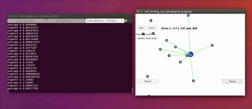

# CarND-Localization-Particle-Filter
Self-Driving Car Engineer Nanodegree Program

---

This repo implements a particle filter localization method for a simulation car with a known map.

# Compile and Run
```bash
mkdir build && cd build
cmake .. && make
./particle_filter
```

# Implementaion
The implementation follows strictly what has been taught in the lectures.
* [`void ParticleFilter::init()`](https://github.com/bo-rc/CarND-Kidnapped-Vehicle-Project/blob/master/src/particle_filter.cpp#L22) initializes the particles using a known initial state of the car with randomly-generated noise.
* [`void ParticleFilter::prediction()`](https://github.com/bo-rc/CarND-Kidnapped-Vehicle-Project/blob/master/src/particle_filter.cpp#L50) uses a simple motion model to predict each particle's state.
* [`void ParticleFilter::updateWeights()`](https://github.com/bo-rc/CarND-Kidnapped-Vehicle-Project/blob/master/src/particle_filter.cpp#L94) uses a Gaussian cross-correlation between predicted landmark features and observed landmark features to re-weight each particle.
* [`void ParticleFilter::resample()`](https://github.com/bo-rc/CarND-Kidnapped-Vehicle-Project/blob/master/src/particle_filter.cpp#L150) randmoly re-draws the same number of particles from the exsiting particle pool depending on the weight of each particle; particles with higher weight may be drawn multiple times. 
* [`void ParticleFilter::dataAssociation()`](https://github.com/bo-rc/CarND-Kidnapped-Vehicle-Project/blob/master/src/particle_filter.cpp#L75) uses a nearest-neighbor algorithm to assign observed features to map features. A simple linear search algorithm is used in this implementation. However, since the map is static, a faster search algorithm for this function is to use a K-d tree to represent the map landmarks. I will revisit this in the future.

# Result

```bash
./run.sh
```
will give the following result (passed):


